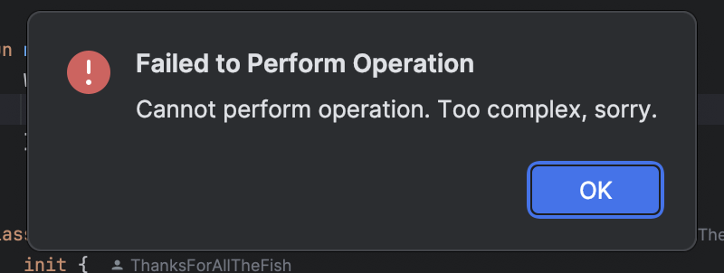

# Issue

When trying to extract a variable from

```kotlin
fun main() {
    WithinALambda {
        Test()
    }
}
```

by typing `Test().val` then pressing `Enter`, nothing happens, no matter how long I wait; when pressing any key, the following dialog appears:



Extracting from

```kotlin
fun main() { 
    Test()
}
```

works as expected (a new variable named `test` is created).